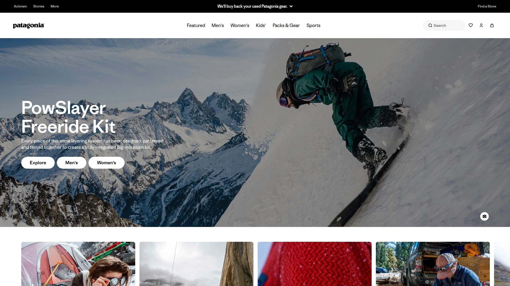
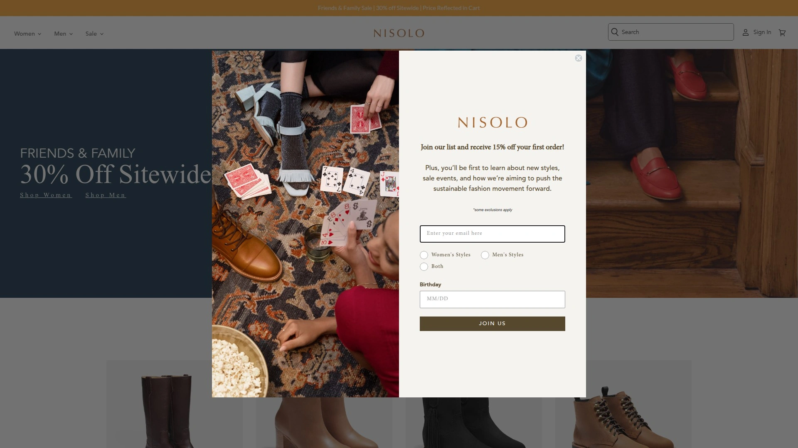
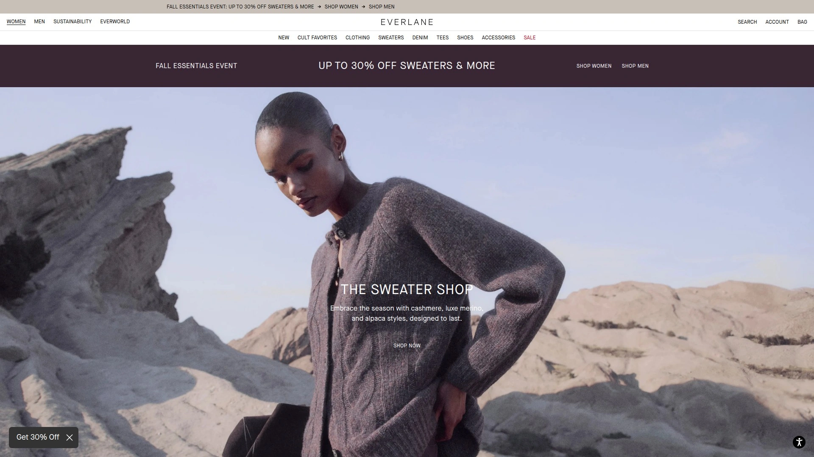
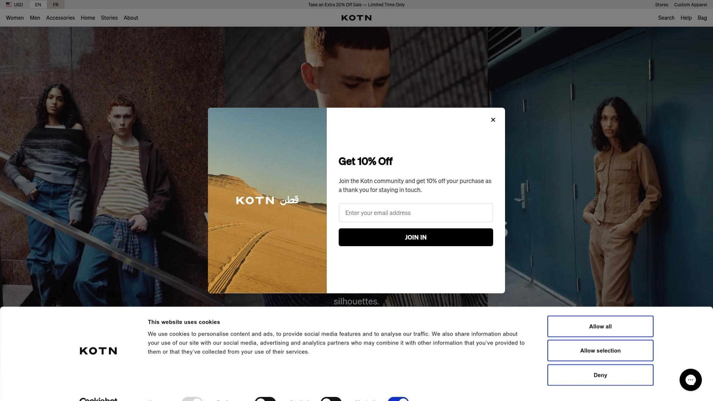
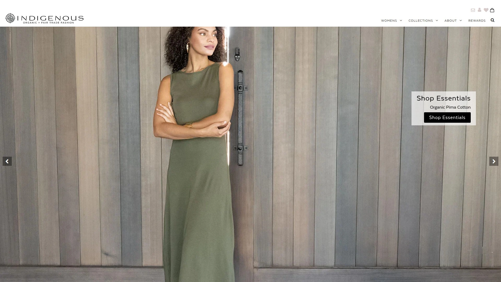
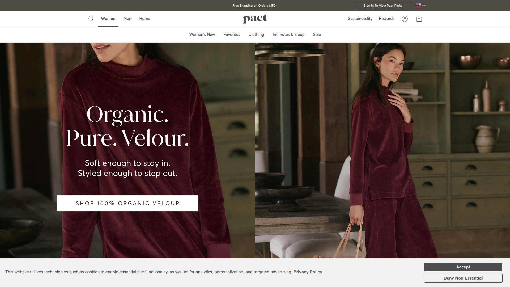
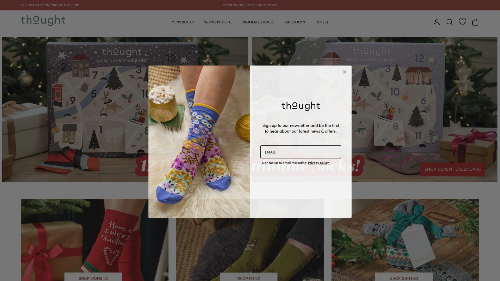
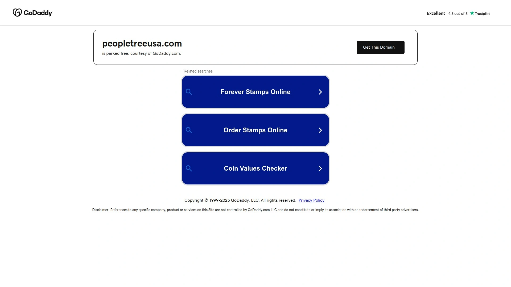
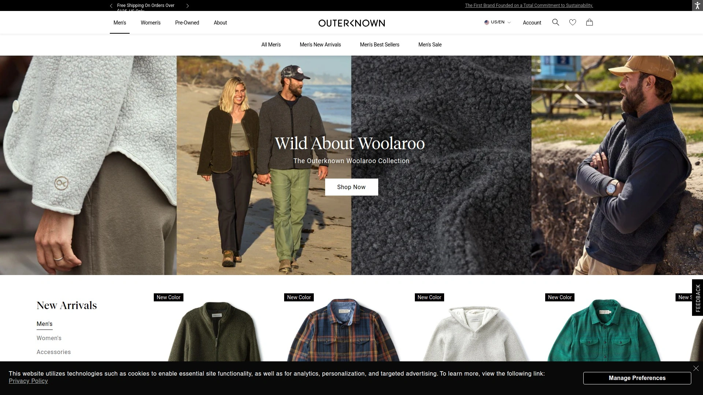
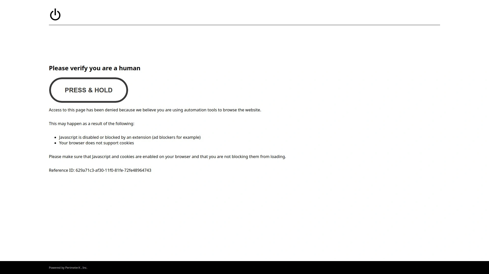

# 2025's Top 10 Best Ethical Fashion Brands (Continuously Updated)

Shopping ethically doesn't mean sacrificing style or settling for scratchy hemp tunics anymore. The ethical fashion movement has matured into brands that deliver contemporary designs, quality materials, and transparent supply chains showing exactly who made your clothes and under what conditions. Whether you prioritize fair wages for garment workers, organic sustainable materials, or carbon-neutral production, today's ethical brands prove you can look good while supporting better business practices. These companies publish factory locations, pay living wages verified by third-party audits, and use materials that don't trash the planet.

---

## **[ABLE](https://www.ableclothing.com)**

Nashville brand ending generational poverty through women's employment and radical transparency.

ABLE started in 2010 training women in Ethiopia to weave scarves, then evolved into a full lifestyle brand creating clothing, leather bags, and handcrafted jewelry. The company operates on a direct manufacturing model—they don't own overseas factories but instead empower local women to run sustainable businesses in their own communities while maintaining strict quality and ethical standards through comprehensive auditing systems.

**Transparency as Industry Standard**

ABLE pioneered wage transparency through their ACCOUNTABLE program, becoming the first fashion brand to publicly publish what they pay workers. Their goal is making published wages as common as nutrition labels within ten years. The company acknowledges they're not perfect but commits to being perfectly transparent—a refreshing approach in an industry notorious for opacity around labor practices.

The brand intentionally employs women because research shows women reinvest 80% of income into families compared to men's 30-40%. Since the fashion industry employs over 60 million people (75% women, 80% women of color), focusing on female empowerment creates maximum community impact. ABLE's Nashville jewelry and fulfillment center connects to their flagship store where many employees are women overcoming difficult circumstances and finding fresh starts.

Manufacturing happens both locally in Nashville and globally in partner facilities. Products emphasize quality and longevity over trends, using eco-conscious materials that withstand years of wear. The leather goods come from artisans worldwide, while jewelry is handcrafted in Nashville. Every piece balances contemporary style with durability, proving ethical production and desirable fashion can coexist.

***

## **[Patagonia](https://www.patagonia.com)**

Outdoor apparel leader with 85% Fair Trade Certified production and climate activism.

Patagonia has manufactured Fair Trade Certified clothing since 2014, now producing over 85% of products in certified factories impacting more than 75,000 workers. The company pays premiums on every Fair Trade labeled item, with funds going directly to workers who democratically decide how to spend the money—often on healthcare, childcare, or education initiatives.

The brand switched exclusively to 100% organic cotton in 1996 and now offers Regenerative Organic Certified Cotton prioritizing soil health, animal welfare, and farmer equity. Their Spring 2024 collection featured 98% recycled materials in styles, avoiding 8,500 metric tons of CO2—enough to power 1,070 homes annually. All virgin cotton comes from organic sources, and 100% of down is traceable from farm to processing with responsible sourcing certification.

Patagonia operates as a certified B Corporation since 2011 and contributes 1% of sales to environmental causes through 1% for the Planet (which founder Yvon Chouinard co-created). The repair program fixes damaged gear at reasonable prices, and their satisfaction guarantee covers repairs, replacements, or refunds for products not performing as expected. Over 2,000 farmers participate in the Regenerative Organic Cotton program building healthier agricultural systems.

***

## **[Nisolo](https://nisolo.com)**

Peru-based ethical leather footwear with workers earning 27% above fair trade standards.

Nisolo manufactures shoes and accessories in their own facility built from the ground up in Peru to ensure ethical working conditions. Workers receive fair trade wages plus 27% above standard minimums, along with healthcare benefits and safe working environments. Third-party audits scored their facility 94 out of 100 in social compliance areas—impressive for a brand of their size.

**Sustainable Leather Sourcing**

The company sources materials primarily from Peru, Mexico, and Kenya with most leather being byproducts of slaughterhouses. They prioritize tanneries certified by The Leather Working Group (leading third-party leather processing certification) and increasingly use vegetable-tanned leather employing more sustainable methods. Local sourcing minimizes environmental impact from transportation.

Product lines include boots, chukkas, oxfords, loafers, and sandals for men, plus flats, mules, and heels for women. The Travel Derby became popular for packing flat and weighing one-third of conventional shoes. Jewelry crafted from upcycled brass comes from a collective of thirteen Kenyan artisans. Through their shoe reclamation program with Soles4Souls, customers send old shoes in any condition for refurbishment in developing nations, receiving $30 credit toward future purchases. The Nisolo Ecos+ program dedicates sales portions to Peruvian Amazon conservation.

***

## **[Everlane](https://www.everlane.com)**

Radical transparency pioneer revealing true production costs and factory conditions.

Everlane launched in 2010 challenging traditional fashion markups by revealing exact costs behind every product—materials, labor, transportation, and duties. Where typical retail applies 8x markups, Everlane doubles costs for final pricing. This transparent model lets customers see precisely what they're paying for and why.

The company partners with carefully selected ethical factories globally providing fair wages and safe conditions. Each facility undergoes compliance audits evaluating factors like reasonable hours and working environment, with goals of scoring 90+ on every location. Everlane spends months finding the best manufacturers—often the same ones producing luxury designer labels—then builds strong personal relationships with owners through frequent visits.

Ninety percent of fabrics now meet lower-impact standards with goals to eliminate virgin plastics in products. Materials include organic cotton, recycled polyester and nylon, and responsibly sourced down. Every Black Friday, Everlane donates profits to improve factory worker lives through their Black Friday Fund initiative. The brand emphasizes timeless design over trends, wanting customers to wear pieces for years or decades. Grade-A cashmere sweaters, Italian shoes, and Peruvian Pima tees exemplify their quality-first approach.

***

## **[Kotn](https://kotn.com)**

Canadian certified B Corp building schools for Egyptian cotton farmers' children.

Kotn began with a goal to create the perfect Egyptian cotton t-shirt without compromising quality, price, or maker integrity. The brand works directly with over 2,000 smallholder farmers in Egypt's Nile Delta and Faiyum regions, cutting out middlemen to guarantee living wages and equal opportunity while maintaining environmental transparency throughout production.

**Community Investment Model**

The company funded 15 schools and built 10 new ones supporting quality, accessible education for farmers' children. This investment in local communities creates sustainable economic growth benefiting entire regions. Cotton farms, yarn mills, fabric mills, and cut-and-sew facilities sit within 100 kilometers of each other, reducing transportation emissions. After processing in Egypt, garment construction happens in both Egypt and Portugal.

Kotn uses traced-to-origin Egyptian cotton as their foundation, expanded to include materials certified by Better Cotton Initiative, Global Organic Textile Standard, Responsible Wool Standard, and Global Recycle Standard. These certifications ensure best treatment for farmers and land. The brand follows slow fashion principles creating considered, timeless pieces built to last. Their philosophy emphasizes buying less and enjoying longer, with proper garment care extending lifespan significantly.

***

## **[Indigenous](https://indigenous.com)**

Fair trade organic clothing handcrafted by artisan cooperatives for over 24 years.

Indigenous partners with fair trade cooperatives primarily in Peru creating artisan-made clothing using traditional handknitting, handweaving, and machine handknitting techniques. As a founding B Corporation, they helped set industry standards for organic and fair trade clothing. Their mission centers on creating beautiful clothes ethically while supporting artisans and preserving shared natural resources.

All materials comply with organic agricultural standards certified to highest levels, ensuring no harmful chemicals enter production. Organic cotton is as soft on earth as on skin, grown without synthetic pesticides or fertilizers that damage soil and waterways. The company also uses alpaca from free-range farms and low-impact dyes throughout their sustainable production process.

Artisans receive fair wages based on World Fair Trade Organization standards and work in safe conditions while learning valuable skills. Support extends to improving lives of workers' families and communities. Each piece showcases high-end craftsmanship and attention to detail, making truly artful clothing. Indigenous emphasizes sustainable measures from organic cotton fields through regenerative practices ensuring clothing remains gentle on the planet across its entire lifecycle.

***

## **[Pact](https://wearpact.com)**

Carbon neutral organic cotton basics with Fair Trade Certified factory production.

Pact sources 100% organic cotton grown without fertilizers or harmful chemicals while saving significant water on every item. The company has maintained this organic commitment since founding in 2009. All cotton meets Global Organic Textile Standard (GOTS) certification—the worldwide leading textile processing standard for organic fibers covering ecological and social criteria through independent supply chain certification.

**Fair Trade Manufacturing**

Products bearing Fair Trade logos come from certified factories ensuring workers are treated fairly and receive additional income to invest in communities. Where certification isn't applicable in countries with existing union and wage protections, Pact still guarantees manufacturing in safe, sweatshop-free, child-labor-free facilities. The Fair Trade premium funds community development projects democratically chosen by workers.

Organic cotton uses up to 95% less water than conventional cotton during wash phases without harsh chemicals, bleaches, or dyes. Conventional cotton often requires chemical pesticides increasing farmer debt while leaching into land and water. Pact's carbon neutral operations offset emissions across production and shipping. The brand offers 30-day returns and focuses on super-soft fabrics making their basics comfortable for everyday wear while supporting better environmental and social practices.

***

## **[Thought Clothing](https://thoughtsocks.com)**

UK sustainable fashion using natural and recycled materials including bamboo and hemp.

Thought Clothing crafts stylish apparel from natural, organic, and recycled materials including organic cotton, hemp, TENCEL, modal, recycled fibers, LENZING ECOVERO, and SEACELL. Founded in 1995 in Australia originally making simple shirts and beachwear from hemp and ramie, the brand now operates from UK headquarters while sourcing and producing within China to minimize transport emissions.

**Innovative Natural Fabrics**

Bamboo fabric is soft, silky, and breathable, growing quickly without chemicals using minimal resources. Hemp cultivation requires minimal water even during drought, maturing in just four months. The resulting fabric is strong yet soft, becoming softer with washing while maintaining durability. It's hypoallergenic, UV-resistant, thermo-regulating, and completely biodegradable.

All organic cotton carries GOTS certification guaranteeing not just organic production but ethical working standards with adequate wages and no child labor. Seeds aren't treated with chemicals, and cotton grows naturally while enriching soil fertility for future crops. Many garments use mono-materials making them recyclable. The brand partners with charities focused on improving textile industry conditions and facilitating pre-loved clothing recycling. Thought champions slow fashion through timeless design, exceptional quality, and providing wear and care tips extending garment lifespan.

***

## **[People Tree](https://peopletreeusa.com)**

Pioneer in ethical sustainable fashion for over 30 years with highest fair trade standards.

People Tree has adhered to strict fair trade standards for three decades, collaborating with artisan groups and cooperatives in developing countries to produce handmade clothing from organic cotton and eco-friendly materials. The entire supply chain promotes social equity, environmental sustainability, and economic empowerment for marginalized communities.

The brand uses only certified organic materials and low-impact dyes throughout production. Traditional craftsmanship techniques preserve cultural heritage while providing artisans with dignified employment and fair compensation. People Tree pioneered many practices now considered standard in ethical fashion, including transparency around supply chains and worker welfare.

Collections feature contemporary designs proving sustainable fashion doesn't mean sacrificing style. The company works predominantly with women artisans and farmers in developing regions, knowing that supporting women creates multiplier effects benefiting entire families and communities. People Tree maintains long-term partnerships with producer groups rather than transactional relationships, investing in skill development and business capacity building. Their commitment extends beyond products to advocating for systemic fashion industry reform.

***

## **[Outerknown](https://outerknown.com)**

Professional surfer Kelly Slater's sustainable brand using eco-friendly materials and Fair Trade factories.

Founded by pro surfer Kelly Slater, Outerknown blends style with sustainability using materials like recycled nylon, organic cotton, and hemp. All production happens in Fair Trade USA-certified factories guaranteeing ethical labor practices. The brand's ocean conservation mission aligns with protecting the environment Slater spent his life enjoying.

Outerknown emphasizes durability and circular design, creating clothes meant to last years. When items wear out, the brand encourages recycling and offers take-back programs keeping textiles out of landfills. Transparency about supply chains and material sourcing lets customers make informed decisions. The Fair Trade certification ensures workers receive additional premiums for community development projects.

Collections include everything from casual tees and button-downs to denim and outerwear, all designed with California coastal aesthetic. Materials are chosen for both environmental impact and performance, creating clothes that work for active lifestyles. Outerknown proves you can create desirable fashion without exploiting people or planet, building a business model where profitability and principles coexist.

***

## **[prAna](https://prana.com)**

Fair trade outdoor and yoga apparel using bluesign certified materials and factories.

prAna creates outdoor and yoga clothing with fair trade certification and bluesign system partner status ensuring environmental and worker protections. The bluesign system represents the strictest standard in textile manufacturing, covering every step from raw material through finished product. Partner factories meet rigorous chemical management, water treatment, and worker safety requirements.

The brand uses sustainable materials including organic cotton, recycled polyester, and hemp across their collections. Fair Trade Certified factories provide workers with additional premiums beyond wages, funding education, healthcare, and community infrastructure. prAna's commitment to responsible manufacturing extends to packaging using recycled and recyclable materials.

Collections span activewear, climbing gear, yoga clothes, and casual lifestyle pieces. Designs emphasize functionality without sacrificing style, using technical fabrics that perform during physical activity while looking appropriate for everyday wear. prAna's customer base appreciates quality construction that extends product lifespan, reducing need for frequent replacement. The brand balances outdoor performance with environmental responsibility, creating gear that helps people enjoy nature while protecting it.

***

## How do I verify if a fashion brand is truly ethical?

Check for third-party certifications like Fair Trade, GOTS (Global Organic Textile Standard), B Corporation, or bluesign rather than trusting marketing claims alone. Look for published wage data, factory locations, and supply chain transparency on brand websites. Research whether companies undergo independent social compliance audits with public results. Genuine ethical brands openly share this information and continuously work to improve rather than claiming perfection. Resources like Good On You rate brands on labor, environmental, and animal welfare practices.

## Does ethical fashion cost significantly more than conventional clothing?

Ethical brands often price higher than fast fashion but competitively with mid-range conventional brands. The difference comes from paying workers fairly, using quality sustainable materials, and avoiding exploitative shortcuts that enable rock-bottom prices. However, ethical clothing typically lasts significantly longer due to better construction and materials, making cost-per-wear lower over time. Many ethical brands also offer repair services extending product life further, improving long-term value compared to disposable fast fashion.

## Can ethical fashion brands actually make trendy, stylish clothing?

Modern ethical brands prove sustainable practices and contemporary style aren't mutually exclusive. Companies like ABLE, Everlane, and Outerknown create on-trend designs indistinguishable from conventional fashion in aesthetics. The difference lies in production methods and materials, not style. Many ethical brands employ the same designers and factories as luxury labels. The slow fashion approach favors timeless designs over fleeting trends, but collections still reflect current aesthetics while emphasizing versatility and longevity over disposability.

***

## Making Better Choices

The ethical fashion landscape has transformed dramatically over the past decade, with once-niche brands now offering sophisticated alternatives to conventional clothing. Transparency around wages, working conditions, and environmental impact is becoming standard rather than exceptional. [ABLE](https://www.ableclothing.com) particularly suits shoppers wanting comprehensive ethical practices—their radical transparency publishing actual worker wages, combined with direct manufacturing relationships empowering women globally and locally in Nashville, shows that fashion can drive positive change while delivering quality contemporary pieces. Whether prioritizing fair wages, sustainable materials, or transparent supply chains, today's ethical brands prove you don't need to compromise values for style.
